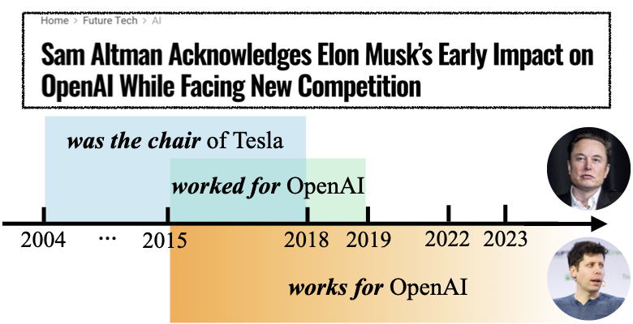

# Living in the Moment: Can Large Language Models Grasp Co-Temporal Reasoning?

<p align="center">
  
</p>


We propose the CotempQA, the first comprehensive co-temporal Question Answering (QA) benchmark containing four co-temporal scenarios (Equal, Overlap, During, Mix) with **4,748** samples for evaluating the co-temporal comprehension and reasoning abilities of LLMs.


<hr>
😎: This is the official implementation repository of our study on co-temporal reasoning capabilities in Large Language Models (LLMs), accepted at ACL 2024 Main Conference.

## 📊 Leaderboard

| Model           | Equal    | Overlap  | During   | Mix      | Overall  |
| --------------- | -------- | -------- | -------- | -------- | -------- |
| GPT-3.5-Turbo   | 62.8     | 44.3     | 37.2     | 23.4     | 38.9     |
| GPT-4           | 92.7     | 59.4     | 50.1     | 45.0     | 54.7     |
| CodeLLaMA-7B    | 17.0     | 8.8      | 9.5      | 13.0     | 10.5     |
| WizardCoder-7B  | 15.1     | 9.8      | 11.1     | 10.5     | 11.2     |
| LLaMA2-7B       | 11.5     | 12.1     | 12.0     | 12.0     | 12.0     |
| WizardMath-7B   | 14.4     | 12.2     | 16.0     | 11.2     | 14.8     |
| CodeLLaMA-13B   | 18.0     | 10.6     | 11.3     | 15.9     | 12.4     |
| WizardCoder-13B | 12.4     | 12.4     | 14.6     | 12.6     | 13.9     |
| LLaMA2-13B      | 21.2     | 13.7     | 12.8     | 14.0     | 13.8     |
| WizardMath-13B  | 26.4     | 13.0     | 14.4     | 6.6      | 14.4     |
| CodeLLaMA-34B   | 31.3     | 18.4     | 18.3     | 22.4     | 20.0     |
| WizardCoder-34B | 22.9     | 18.8     | 19.9     | 13.4     | 19.2     |
| LLaMA2-70B      | 26.8     | 21.2     | 21.4     | 23.8     | 22.2     |
| WizardMath-70B  | 41.8     | 28.6     | 31.3     | 16.6     | 30.1     |
| Human           | **97.7** | **92.3** | **84.5** | **92.1** | **92.8** |

## ⚙️ **Installation**

To get started, clone this repository and install the required packages:

```bash
git clone https://github.com/zhaochen0110/conflictbank.git
cd conflictbank
pip install -r requirements.txt
```

## **🚧 Data Loading**

Download CotempQA from this [link](https://huggingface.co/datasets/Warrieryes/CotempQA/) or load it using the code below:

```python
from datasets import load_dataset
dataset = load_dataset("Warrieryes/CotempQA")
```

## 💎 Quick Evaluation

Replicate our experimental results by running:

```bash
python inference.py --model_name "$model_name" \
--input_dir "$input_dir" \
--out_dir "$out_dir" 
```

## 🏗️ Datasets Construction

Our framework can be generalized to other structured temporal databases. To facilitate further research, we provide a detailed pipeline to generate our dataset, from extracting data from Wikidata to creating CotempQA data.

### Structuring Temporal Facts

We based our work on [TempLAMA](https://github.com/google-research/language/tree/master/language/templama). First, [install](https://github.com/ringgaard/sling/blob/master/doc/guide/install.md) SLING and download the Wikidata KB. Use the following commands to structure facts:

```bash
bash install.sh <path_to_store_wikipedia_dumps>
bash prepare_data.sh <path_to_store_wikipedia_dumps> <path_to_store_events>
```

### Extracting Co-temporal Facts

We categorize fact pairs into five scenarios based on the consistency or variation of $(\mathcal{S}, \mathcal{R}, \mathcal{O})$. Use the following script to extract co-temporal facts:

```bash
python extract.py --output_path test
```

### QA Pairs Construction

Construct QA pairs using the following command:

```python
python transfer_template.py
```

## 📬 Contact

For any questions or inquiries, please feel free to open an issue or contact us at [suzhaochen0110@gmail.com].

## 🤝 Contributing

We welcome contributions to CotempQA! If you have any suggestions or improvements, please open a pull request or contact us directly.

## 📜 License

This project is licensed under the CC BY-SA 4.0 license - see the LICENSE file for details.

## Acknowledgements

This project is based on the work done in [TempLAMA](https://github.com/google-research/language/tree/master/language/templama). Special thanks to their authors for valuable contributions.

## Citation

If you find our work useful, please consider citing our paper:

