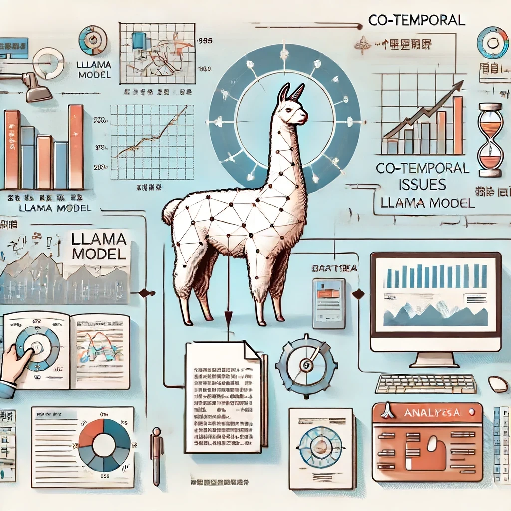

# Living in the Moment: Can Large Language Models Grasp Co-Temporal Reasoning?

<p align="center">
  
</p>


<hr>
😎: This is the official implementation repository of our study on co-temporal reasoning capabilities in Large Language Models (LLMs).

## 🔥 Supported
The dataset can be downloaded from [this link](https://drive.google.com/drive/folders/1HLnVdPPerWS1KX5p1Q38UQaHOGidsf5X?usp=drive_link).

Additionally, we offer comprehensive support tools including:
- Extracting Co-temporal Facts
- QA Pairs Construction
- Evaluation for various models (GPT, LLaMA, WizardLM series ...)


## 1.Dataset


Meanwhile, you can also choose to use linux command to download the dataset:

```bash
wget https://drive.google.com/drive/folders/1HLnVdPPerWS1KX5p1Q38UQaHOGidsf5X?usp=drive_link
```

## 2.Data Creation

Beside the dataset can be used straightly, we also reveal all details to generate the different CoTempQA Dataset versions.

#### （1）prepare the row data

Before generating the data, we need to undertake some preparatory steps, including gathering essential raw data. Notably, all raw data can be categorized into four levels, namely v3, v4, v5, and all. As the levels progress, the volume of data contained in the raw data also increases.

1. All raw materials used to build our co-temporal can be downloaded from [this link](https://drive.google.com/drive/folders/1Ep_pgNAFPEmeqgNl3vkT6UIp6hC4b4RD?usp=drive_link). 

   ```bash
   wget https://drive.google.com/drive/folders/1oBZuU50i5AX3HLjak4mR6qIJssM8uh7y?usp=drive_link
   ```


2. The data construction pipeline is also provided in our repository which supports to build the up-to-date co-temporal datasets from current wikipedia dumps.

   ```bash
   bash install.sh <path_to_store_wikipedia_dumps>
   bash prepare_data.sh <path_to_store_wikipedia_dumps> <path_to_store_events>
   ```


### (2) Extract co-temporal relationship from raw data

In this step, we will traverse and compare the time occurrences of relevant tasks, converting synchronous events into structured representations. Meanwhile, we will transform the structured representation into  natural language forms. Then we will categorize the obtained data into four types, namely equal, during, overlap, and mix. Notably, we have prepared raw data of various sizes. In order to generate datasets of different volumes, we can use raw data of different sizes.

```bash
python extract.py --data_level v3 --output_path test
```


### (3) Add Co-temporal expression

In this step, we will add suffixes to the preliminary data to incorporate co-temporal descriptions, for instance, 'during the same time span'.

```bash
python transfer_template.py
```


### (4) Evaluation

After the model performs inference on this dataset, we can extract answers from the generative answer using template matching, with accuracy and F1 score as evaluation metrics. We provide two different python script to evaluate GPT or open source model in huggingface.

1. Evaluate open source model (the evaluate result will be saved as a json file)

   ```bash
   bash run.sh
   ```

2. Evaluate Gpt series model.

   ```
   python evaluate_for_gpt.py --in_file <Path to co-temporal dataset> \
   --out_file <Path to the gpt's generation> \
   --mode <use which way to evaluate the co-temporal ability of llms> 
   
   bash evaluate.sh
   ```

